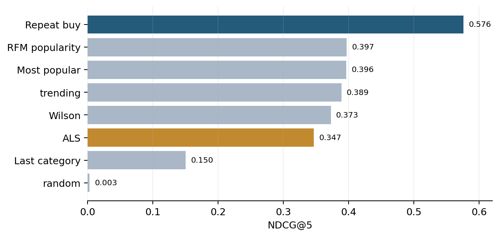

# Personalized Grocery Coupon Recommendation on the Dunnhumby Complete Journey Panel

*Scientific report · Dunnhumby Complete Journey · September 2026*

<!-- Grading: % after each heading is that criterion's weight (Day 1, Block 6).
     Communication quality (5%) applies to the whole document. Sections 1–6 = 95%; +5% = 100%. -->

## Abstract

## 1. Problem — Problem framing and relevance (10%)

### 1.1 The business problem

A grocery retailer runs coupon campaigns for its customers. In the data we use we
observe these campaigns for a panel of **2,500 loyalty-card households** over two
years. The retailer already aims campaigns at broadly relevant shoppers — in our
analysis of the data, the households chosen for a campaign had spent about **2.5
times the average** in that campaign's product categories — but it does not tailor
the specific products offered to each household. Because households shop very
differently, many offers still reach people who would not have bought the product
anyway, wasting both the customer's attention and the retailer's limited campaign
capacity: we find that only about **12% of the household–campaign pairs the
retailer targeted led to any redemption**. The user we design for is a **category
or CRM manager** who must decide, before each campaign, which products to offer
each household a coupon on.

### 1.2 What the recommender does

For each household, the system produces a short ranked list of products to offer a
coupon on — the products that household is most likely to buy in the near future.
It can only choose from **coupon-eligible products**: the roughly 44,000 items (out
of a ~92,000-product catalogue) that a coupon exists for. This is a ranking task —
order the candidates, return the top few — not a yes/no prediction, and not a
search where the customer types in what they want.

### 1.3 What the model learns from

The only signal available is what households bought, never what they thought of a
product. This is *implicit feedback*: a purchase is a positive signal, but the
absence of a purchase is not a negative one — the household may simply never have
been offered the product or noticed it. The model treats "not bought" as
*unknown*, not as *disliked*. We deliberately do not score the recommender against
the retailer's own past targeting choices: those record *who the retailer decided
to contact*, not *who wanted the offer*, and matching them would just teach the
model to copy the retailer, bias included. Instead we score every method against
what households **actually bought** in a later period.

### 1.4 Research question and scope

Following the course template — *under protocol P, does method X improve metric Y
over baseline Z, and at what cost to metric W?*:

> Under a temporal train/validation/test split of the Dunnhumby "Complete Journey"
> panel, with a closed candidate set of coupon-eligible products and households
> scored on their test-period purchases, does **weighted implicit ALS** improve
> **Recall@5 and NDCG@5** over a **most-popular-products baseline**, and what does
> it cost in **catalogue coverage**?

In plain terms: can personalising the offer list beat "send everyone the
bestsellers" at predicting what each household buys next, without shrinking the
range of products we ever recommend?

**Scope.** If the personalised model wins, we can say it predicts future purchases
more accurately than a simple rule. We cannot claim that sending a coupon *causes*
a purchase — this is an offline study of prediction, not a controlled experiment.

**Contributions.** (1) A clean, reproducible setup for the task: a frozen
past/future split, a defined product menu, and a clear definition of a correct
recommendation. (2) A like-for-like comparison of a simple baseline against a
personalised model, scored on real purchase behaviour. (3) An honest account of
the trade-off between relevance and coverage, and of the study's limitations.

## 2. Dataset — Data understanding and reproducibility (15%)

### 2.1 The dataset

We use the Dunnhumby "The Complete Journey" panel [1]: every purchase made by
2,500 loyalty-card households at a US grocery retailer over about two years (102
shopping weeks), together with the retailer's coupon-campaign records. It contains
roughly **2.6 million purchase lines** across a **~92,000-product catalogue**, plus
**1,135 distinct coupons** and a record of which campaign each household received
and which coupons it redeemed. Every product also carries a category label: it
rolls up into one of ~300 broad **commodities** (e.g. "yogurt") and ~40
**departments** (e.g. "dairy"). A further file marks whether a product was in the
weekly mailer or on an in-store display; we do not use it, because this study
predicts purchases rather than measuring the causal effect of promotions.

### 2.2 Data quality and cleaning

The data is unusually clean. There are **no missing values** in the purchase,
product or coupon tables, **no duplicated purchase lines**, and every purchase and
every coupon links to a real catalogue product. We also confirmed each raw file
matches the published dataset size, so nothing was truncated or re-exported.

The only issue is a small set of odd lines: about **0.6% of purchase lines have a
quantity of zero or below**, and about **0.7% have a sales value of exactly zero**
(returns, giveaways or scanning glitches). We exclude these — a purchase, for us,
is a line where money changed hands and at least one unit was bought — which
removes roughly **1% of the data** and leaves the rest untouched. No other
cleaning is applied.

One caveat about the money field: the recorded "sales value" is what the
**retailer received** after loyalty and coupon discounts, not the price the
shopper paid. This does not affect the model, which only uses *whether* a product
was bought, but it would matter if the model were later weighted by spend.

### 2.3 What we recommend, and how thin the evidence is

The recommender can only offer a coupon for a **coupon-eligible product** — one
that appears in the coupon records. There are **44,133** of these (about **48% of
the catalogue**); **39,132** were bought by at least one household during
training, and those form the pool the model chooses from. Coupons map to products
unevenly: a typical coupon covers about a dozen products, but a few broad coupons
("any private-label frozen vegetable") cover thousands.

The evidence the model has to work with is thin. Picture a table with one row per
household (2,500) and one column per coupon-eligible product (~44,000) — about 110
million cells, each answering "did this household ever buy this product?" Only
about **0.7% of the cells are 'yes'**; the rest are pairings that never occurred.
This is what we mean by **sparse**: the table is almost entirely empty. It is
normal for grocery, and it means the model cannot build a rich picture of each
household on its own — it has to borrow patterns from households that shop
similarly.

Products also roll up into broader groups: ~300 **commodities** (e.g. "yogurt")
and ~40 **departments** (e.g. "dairy"). At that coarser level the same shopping is
far denser — a typical household has bought something in about a third of the
commodities — so category history is a useful fallback when a household's record
for individual products is too thin.

### 2.4 Design implications

Every point below is a simple count on the raw data — no model is involved — but
each one points to a modelling choice:

- **Demand is spread out.** The 100 best-selling products account for only about
  15% of all purchases, so a plain "recommend the bestsellers" rule can only go so
  far and personalisation has genuine room to add value.
- **The task is mainstream.** Coupon-eligible products make up about **60% of all
  shopping** (by lines and by money spent), so this is a central lever for the
  retailer, not a niche one.
- **Histories are long.** A typical household made about 80 shopping trips and
  bought roughly 200 different coupon-eligible products in training — plenty to
  personalise from. Only ~4% of households barely shopped (fewer than 10 trips in
  two years); ~1% shopped so heavily (over 500 trips) they would dominate an
  unadjusted "most-bought" ranking.
- **Almost every household can be scored, and cold start is not a concern.** Of
  the 2,500 households, **2,364** bought at least one coupon-eligible product in
  the test period and can be scored, and **99.8%** of them have prior history.
- **The test period is a demanding target.** We do not train or tune on the test
  weeks, but we can describe what is in them. In that window a household buys about
  **66** different products the recommender could offer a coupon on, and **about
  61% are ones it had never bought before** — so a recommender that only replays
  past favourites would miss most of what happens. Because each household's target
  is large, absolute Recall figures will be small; the comparison *between*
  methods is what matters (see §5).
- **A purchase is a trustworthy sign of preference.** We score methods on what
  households bought in the test period, so "bought it" needs to mean "wanted it",
  not "it was on offer that week". Only about **1.6%** of the coupon-eligible
  purchases we score against had a manufacturer coupon attached; the other ~98%
  were bought at normal price, so the promotion effect is too small to distort the
  comparison.
- **Demographics are not used as a model input.** The household demographic file
  (age, income, family) covers only about **32%** of households, and those
  households spend markedly more than the rest — the coverage is not random.
  Feeding it to the model would bias it toward that third of the panel; it is kept
  only for a possible subgroup check.

For context, the retailer's current targeting sets a low but non-zero bar: only
about **12%** of the household–campaign pairs it targeted led to any redemption,
though the households it chose had already spent about **2.5×** the average in the
relevant categories.

### 2.5 Reproducibility

All figures above are produced from the raw files by the exploratory notebook
(`notebooks/01_eda.ipynb`) and the shared task builder, which apply the same
cleaning rule and past/future split and record every number used here. Figures
that describe the scored task (ground-truth size, new-versus-repeat share) are
taken from the task builder, which additionally restricts test purchases to the
candidate set; the notebook's un-restricted counts are a few percent larger. The
past/future split — training weeks 1–79, validation 80–84, test 85–102 — is fixed
in a shared configuration file and imported everywhere, so it cannot
drift between the exploration, the baselines and the final model. The dataset is
publicly available on Kaggle [1]; the repository holds the code and the split
definition, and one command regenerates the results.

## 3. Baseline — Meaningful baseline (15%)

### 3.1 Why a ladder of baselines

A baseline is the minimum a personalised method has to beat to be worth its
complexity. Rather than compare against a single rule, we build a **ladder** of
increasingly capable simple methods, so that "the personalised model adds value"
has a precise meaning: it must beat the *strongest* rung, not the weakest.

The course ladder runs: (1) random, (2) most-popular, (3) category- or
segment-popular, (4) trending, (5) uncertainty-aware. We implement all five and
add two rules that are standard in grocery: **repeat purchase** and a
**category-content** rule.

### 3.2 The baselines

Every baseline recommends five products per household, chosen from the same
~39,000 coupon-eligible products that were bought at least once during training,
and is scored the same way against the household's test-period purchases (the
protocol is in §5). The headline figure is **NDCG@5**, which runs from 0 (none of
the five products was bought) to 1 (the five top-ranked slots are all correct); it
rewards putting the right products high in a short list. **Recall@5** — the share
of a household's later purchases recovered — is reported too but is structurally
small here: with a household buying about 66 different products in the test window,
even a perfect five-item list can only recover a handful. **Hit-Rate@5** is the
share of households for which at least one of the five was bought, and **coverage**
runs from near 0 (the same five products to everyone) to 1 (the whole candidate
set used).

| # | Baseline | What it recommends |
|---|---|---|
| 1 | Random | five products at random — the sanity floor |
| 2 | Most popular | the five most-purchased products, the same list for everyone |
| 3 | Segment-popular | the five most-purchased products *within the household's value segment*, where segments are built from how recently, how often and how much each household shops (RFM) |
| 4 | Trending | most-popular, but weighting recent purchases more heavily |
| 5 | Uncertainty-aware | popularity adjusted downwards for products bought by only a handful of households, so a rarely-bought item cannot rank high on thin evidence |
| + | Repeat purchase | the five products the household itself bought most often during training |
| + | Category-content | products from the grocery categories the household spends the most on |

### 3.3 What the baselines show

| Baseline | NDCG@5 (95% CI) | Hit-Rate@5 | Coverage |
|---|---|---|---|
| Repeat purchase | **0.576** [0.562, 0.589] | 0.86 | 0.082 |
| Segment-popular | 0.397 [0.386, 0.407] | 0.81 | <0.001 |
| Most popular | 0.396 [0.385, 0.407] | 0.81 | <0.001 |
| Trending | 0.389 [0.378, 0.400] | 0.80 | <0.001 |
| Uncertainty-aware | 0.373 [0.362, 0.384] | 0.77 | <0.001 |
| Category-content | 0.150 [0.141, 0.160] | 0.40 | 0.016 |
| Random | 0.003 | 0.01 | 0.261 |

Three things stand out.

**The non-personalised rungs are all the same.** Most-popular, segment-popular,
trending and uncertainty-aware land within a whisker of each other (NDCG@5 ≈
0.37–0.40); their confidence intervals overlap, so the four cannot be ranked
against one another. Segmenting customers, weighting for recency, or correcting
for small samples does not change the top five, because the best-selling grocery
products are near-universal — almost every household buys them.

**Repeat purchase breaks away.** Recommending a household's own most-bought
products scores NDCG@5 0.576, with a confidence interval ([0.562, 0.589]) that
clears every other method's, so the gain is not sampling noise. The only simple
signal that genuinely helps is the household's own history.

**Personalisation trades a little accuracy for much wider reach.** The
non-personalised rules recommend almost the same five products to everyone
(coverage near zero). Repeat purchase spreads recommendations across about 8% of
the eligible range — a first sign of the relevance-versus-coverage trade-off that
§6 examines.

Every baseline also does better for light shoppers than for heavy ones — for
example, repeat purchase reaches Recall@5 ≈ 0.07 for the least active third of
households against ≈ 0.035 for the most active third. A light shopper buys few
products, so a five-item list covers a larger share of them.

### 3.4 The bar to clear

**Repeat purchase (NDCG@5 0.576) is the bar the personalised method in §4 must
clear.** Most popular (0.40) is reported as the non-personalised reference the
pitch committed to, but it is not the hardest comparison.

As a check, we re-ran every baseline in an *exclude-seen* mode: the same methods,
scored the same way, but each household's own training purchases are removed from
its ranked list before the top five are taken, so a method can only score on
products the household had never bought. Every method then drops by roughly
two-thirds (to NDCG@5 ≈ 0.10), and repeat purchase — having nothing of its own
left to recommend — falls back to popularity. Most of what the simple methods get
right is repeat buying; predicting genuinely new purchases is far harder. §6
returns to this.

## 4. Method — Method design and implementation (20%)

### 4.1 Product-level interaction representation

All models learn from purchases in weeks 1–79 only. After filtering to
positive-quantity, positive-value purchase lines, repeated household–product
events are aggregated into a sparse interaction matrix. Rows are households and
columns are the 39,132 coupon-eligible products observed during training. For
household *u* and product *i*, the implicit preference is binary, p_ui = 1 when
the household bought the product and 0 otherwise. Purchase frequency r_ui is
retained as a confidence signal. This distinction matters: a zero means
"unobserved", not "disliked".

The matrix contains 642,237 observed household–product pairs and has density
0.66%. It is therefore suitable for a latent-factor method designed for
positive-unlabelled data. Candidate products and all aggregate statistics are
computed from training only. Test purchases never affect the candidate pool,
popularity counts, segment definitions or model parameters.

### 4.2 Weighted implicit ALS

The advanced method is weighted implicit alternating least squares (ALS),
following Hu, Koren and Volinsky [2]. In the implementation, observed purchase
counts are scaled by alpha before fitting, while unobserved pairs retain the
library's default background confidence. The method learns a low-dimensional
household vector x_u and product vector y_i by minimizing

L = sum_ui c_ui (p_ui - x_u^T y_i)^2 + lambda (sum_u ||x_u||^2 + sum_i ||y_i||^2).

Holding product vectors fixed makes the objective a regularized least-squares
problem for each household; holding household vectors fixed gives the
corresponding product update. Alternating these steps scales to the sparse matrix
without sampling unobserved pairs. Recommendation scores are dot products
x_u^T y_i. The five highest-scoring products in the fixed candidate set are
returned. Previously purchased products remain eligible (exclude_seen=False)
because grocery replenishment is a valid and commercially important
recommendation; the exclude-seen condition is retained as a diagnostic, not the
deployed task.

This is a deliberate departure from the common convention of removing previously
purchased items from the candidate list. That convention suits domains such as
film or news, where re-consumption is rare; in grocery, replenishment of known
products is the majority of demand and a commercially valid recommendation. We
therefore treat the include-seen setting as the deployed task and report the
exclude-seen setting as a discovery diagnostic (§5.4).

### 4.3 Hyperparameter selection

We evaluated eight deliberately small ALS configurations on validation weeks
80–84. Factors varied over {4, 8, 12}, alpha over {5, 10}, regularization over
{0.05, 0.1, 0.2}, and iterations over {10, 15}. The selection rule was fixed in
advance: highest validation NDCG@5, then Recall@5 and coverage as tie-breakers.
The winning configuration used four factors, alpha 5, regularization 0.1 and ten
iterations. It achieved validation NDCG@5 = 0.2049 and Recall@5 = 0.0410. The
parameters were copied unchanged into the final test runner; no test result was
used to revise them.

The low latent dimension is plausible for a grocery panel: the item space is large
but much of the structure is governed by a smaller number of stable tastes and
replenishment patterns. Strong regularization is also appropriate because most
household–product cells are unobserved. Nevertheless, the grid is intentionally
modest; a larger search could improve ALS, but would also increase the risk of
overfitting one five-week validation window.

### 4.4 Implementation and reproducibility

The implementation uses the `implicit` library with SciPy CSR matrices. Data
loading, task construction, model fitting, recommendation and evaluation are
separated into modules. `run_baselines_validation.py` and `run_als_validation.py`
operate on weeks 1–79/80–84. `run_baselines.py` and `run_als_test.py` evaluate the
frozen methods on weeks 85–102 and save machine-readable CSV artifacts. A fixed
seed of 42 is used wherever randomness is involved. Every method routes through the
same evaluation function and receives the same households, ground truth and
candidate set.

## 5. Evaluation — Evaluation rigor (25%)

### 5.1 Frozen protocol

| Component | Choice |
|---|---|
| Task | Top-K product ranking, K = 5 |
| Split | Temporal — train weeks 1–79, validation 80–84, test 85–102 |
| Relevance | Binary: a candidate product the household bought in the test weeks |
| Candidate set | 39,132 coupon-eligible products with at least one training purchase; closed and identical for every method |
| Filtering | Households with no relevant test purchase excluded (2,364 scored); the primary run keeps already-bought products, an exclude-seen diagnostic (§5.4) removes them |
| Metrics | NDCG@5 (headline), Recall@5, Hit-Rate@5; catalogue coverage as the trade-off metric |
| Uncertainty | Percentile bootstrap 95% confidence intervals, 1,000 household resamples, seed 42 |

The protocol consists of four explicit components. First, the temporal split
mirrors deployment: train on weeks 1–79, select hyperparameters on weeks 80–84 and
evaluate once on weeks 85–102. Second, the candidate set is closed: coupon-eligible
products bought at least once during training after cleaning. Third, ground truth
for household *u* is the set of candidate products actually purchased by that
household in the evaluation window. Fourth, households with no relevant test
product are excluded. This leaves 2,021 households in validation and 2,364 in
test. The test window spans 18 weeks so that products with a multi-week
repurchase cycle are still represented in each household's ground truth; a
shorter window would mislabel regular buyers of slower-moving products as
non-buyers.

Recommendations are lists of length K = 5. The relatively short list reflects
limited customer attention and makes the output usable by a CRM manager. It also
makes the task demanding: the median household has 66 relevant products in test,
while the model may retrieve only five.

### 5.2 Metrics

For a recommendation list R_u^5 and relevant set G_u, Recall@5 is
|R_u^5 intersect G_u| / |G_u|. It measures the share of future purchases
recovered.
NDCG@5 discounts correct products appearing lower in the ranking and normalizes by
the ideal DCG for each household. Hit Rate@5 is one when at least one recommended
product is purchased and zero otherwise. Catalogue coverage is the number of
distinct recommended products divided by the 39,132 candidates. Recall and NDCG
are macro-averaged across households. Percentile bootstrap 95% confidence
intervals use 1,000 household resamples with seed 42: each resample redraws the
scored households with replacement and recomputes the mean, and the interval runs
from the 2.5th to the 97.5th percentile of those means. Two methods whose
intervals do not overlap differ by more than sampling noise; overlapping intervals
mean the difference is not established. All methods rank the full
candidate set of 39,132 products rather than a sampled subset of negatives, so
metric values are directly comparable across methods and are not inflated by an
easier candidate pool.

We also report Recall@5 by household activity tier (light, mid and heavy) and by
warm/cold status. The activity tiers are equal-size thirds of the scored
households, ranked by number of training-period shopping trips, and are distinct
from the small "barely shops" group flagged in §2.4. Activity-stratified results
test whether a headline average hides systematic failure. Cold-start results are
descriptive only because just five test households have no prior eligible-product
history.

### 5.3 Final test results

Table 2 reports the include-seen condition that matches grocery replenishment.
Repeat purchase is the clear winner: Recall@5 = 0.0512, NDCG@5 = 0.5758 and Hit
Rate@5 = 0.8579. ALS reaches Recall@5 = 0.0318, NDCG@5 = 0.3468 and Hit Rate@5 =
0.7665. Thus ALS does not beat either the strongest baseline or the
global-popularity reference. Relative to repeat purchase, ALS is 38.0% lower in
Recall and 39.8% lower in NDCG. ALS's NDCG@5 interval [0.336, 0.357] lies entirely
below both the popularity reference [0.385, 0.407] and repeat purchase [0.562,
0.589], so it is significantly worse, not merely lower; on Recall@5 the ALS
interval [0.029, 0.034] overlaps popularity's [0.031, 0.036], so there the two are
statistically indistinguishable. The repeat-buy Recall confidence interval [0.0482,
0.0548] is entirely above the popularity interval [0.0311, 0.0363].

*Figure 1. Test NDCG@5 by model (include-seen condition).*

| Model | Recall@5 | NDCG@5 | Hit Rate@5 | Coverage |
|---|---|---|---|---|
| Repeat purchase | 0.0512 | 0.5758 | 0.8579 | 0.0815 |
| Most popular | 0.0336 | 0.3963 | 0.8118 | 0.00013 |
| RFM popularity | 0.0335 | 0.3968 | 0.8135 | 0.00015 |
| Trending | 0.0319 | 0.3889 | 0.8033 | 0.00013 |
| ALS | 0.0318 | 0.3468 | 0.7665 | 0.00437 |
| Wilson | 0.0288 | 0.3728 | 0.7733 | 0.00013 |
| Last category | 0.0115 | 0.1504 | 0.4048 | 0.0157 |
| Random | 0.0001 | 0.0030 | 0.0123 | 0.2612 |

The result is not evidence that personalization is useless. Repeat purchase is
itself household-specific and uses a highly predictive domain property: grocery
demand is recurrent. ALS compresses hundreds of product interactions into only
four latent dimensions and consequently smooths away some exact product identity.
Its coverage of 0.44% is wider than global popularity but far below repeat
purchase (8.15%). Random has the widest coverage and essentially no relevance,
showing why coverage must be interpreted jointly with ranking quality.

### 5.4 Segment and diagnostic analysis

Repeat purchase outperforms ALS in every activity tier. Recall@5 for repeat
purchase is 0.0654/0.0514/0.0380 for light/mid/heavy households; ALS achieves
0.0462/0.0296/0.0205. Recall falls with activity because heavy shoppers buy larger
and more varied test baskets, so five recommendations cover a smaller fraction of
their ground truth. This denominator effect cautions against reading the tiers as
a simple measure of household modelability.

The exclude-seen diagnostic confirms that novel-item recommendation is much
harder. Repeat purchase necessarily falls back to popularity and obtains NDCG@5 =
0.1048; most baselines converge near the same level. ALS, run under the same
condition, reaches NDCG@5 = 0.1095 — inside that cluster and no better than the
simple rules. Personalisation therefore adds nothing on discovery either: ALS does
not beat the baselines under any condition tested. Of the products the recommender
is scored on, 61.4% are new to the household, and the repeat 38.6% is much more
predictable.
This score should be read as a lower bound on discovery quality rather than a true
measure: offline, a recommended new product only counts as correct if the
household happened to buy it anyway during the test weeks, so a good suggestion
the household was never exposed to scores the same as a poor one. Future work
should therefore evaluate replenishment and discovery as separate product
objectives instead of forcing one ranking to serve both.

## 6. Discussion, limitations and responsible use (10%)

### 6.1 Interpretation

The research question is answered negatively: under the frozen protocol, weighted
implicit ALS does not improve Recall@5 or NDCG@5 over the strongest
repeat-purchase baseline, and it provides less coverage. It also underperforms
global popularity. This is an informative result rather than a failed experiment.
The course principle that model complexity must earn its place is borne out
empirically: a transparent rule based on exact personal history is more useful
here than a compact latent-factor representation.

Several mechanisms may explain the result. Grocery purchasing is strongly habitual
at SKU level; substituting latent similarity for exact identity can hurt
replenishment. The candidate catalogue is extremely large relative to 2,500
households. A four-factor model is regularized but may be too coarse, while
higher-dimensional configurations produced worse validation NDCG. Finally,
frequency-based confidence may give greater weight to repeatedly purchased staples
and concentrate recommendations, although this mechanism was not tested directly.

### 6.2 Limitations and risks

The panel is observational and limited to 2,500 loyalty-card households at one US
retailer. Purchases are implicit feedback: missing interactions may reflect
dislike, lack of awareness or exposure, lack of availability, or lack of need. The
preliminary campaign analysis is additionally affected by logging and exposure
bias because the retailer's previous policy determined which households received
each campaign. Therefore, non-redemption cannot be interpreted as rejection or
compared directly with the product-ranking metrics. The evaluation measures
purchase prediction, not coupon incrementality. A recommended product might have
been purchased without the coupon; offline relevance therefore cannot establish
causal lift or profitability.

The closed candidate rule excludes coupon-eligible products without training
purchases and cannot assess true cold-item discovery. The findings are therefore
conditional on this candidate set and the frozen K=5 include-seen protocol. The
test period contains week 92 as an unusual high-sales week, although aggregate
test sales are only 0.59 standard deviations above the full-period weekly mean.
The temporal split reduces leakage, but a single test window cannot demonstrate
stability across periods. Demographics cover 32% of households and are strongly
non-random with respect to spend, so they were excluded. Cold-household
performance is based on five cases and should not be generalized. Coverage
measures exposure breadth but not diversity within a household's list, novelty,
benefit distribution, margin, stock availability or coupon cost. The validation
window (five weeks) and the test window (eighteen weeks) also differ in length, so
validation and test scores are not directly comparable; validation was used only
to rank configurations, not to estimate test performance. Finally, the confidence
intervals capture sampling noise on this one panel only; they say nothing about
how the results would hold across other periods, retailers or populations.

### 6.3 Responsible deployment

A production system should not automatically issue coupons from these rankings.
The list should remain a decision aid for a CRM manager and pass eligibility,
inventory, margin, coupon-cost, frequency-cap and legal checks. Recommending only
habitual products could subsidize purchases that would have occurred anyway and
concentrate benefits on already valuable customers. Conversely, a pure discovery
objective could waste customer attention and discount budget.

Repeat purchase is the leading candidate for controlled online evaluation, while
ALS or a hybrid should first demonstrate stronger offline evidence. A randomized
A/B test should compare the candidate policy with business-as-usual targeting and
measure incremental redemption, purchases and margin net of coupon cost, together
with opt-outs and benefit distribution across household groups. Performance,
catalogue exposure and temporal drift should be monitored after launch because
behaviour, prices, inventory and product availability may change.

The data use coded household identifiers but still describe detailed household
behaviour. In a production setting, access should be restricted, identifiers
minimized, retention bounded and subgroup reporting aggregated. Protected
characteristics or sensitive demographic proxies should not determine coupon value
or eligibility without an explicit fairness review.

### 6.4 Future work

Future work should separate replenishment from discovery. A two-stage system could
retrieve recurrent products using time-decayed purchase history, add discovery
candidates, and re-rank them to balance relevance, novelty and catalogue coverage.
EASE [4] could model item-to-item co-purchase patterns, although its computational
feasibility would need assessment for the 39,132-product candidate set. BPR [3]
could optimize discovery ranking, but its negative sampling requires care because
an unpurchased product is not necessarily disliked. LightFM [5] could incorporate
product-hierarchy features without relying on the incomplete demographic data.

One smaller, low-cost improvement would strengthen the evaluation itself: a
rolling-origin temporal validation — several successive train/validation folds of
equal length to the test window — would give a variance estimate for each method
and make validation and test scores comparable, replacing the single five-week
validation window used here. Any new method should then be compared through this
rolling validation, followed by a randomized A/B test measuring incremental
purchases and margin net of coupon cost.

## 7. Conclusion

This project reframed coupon targeting as a product-level top-five ranking problem
and evaluated recommendations against later purchases. The reproducible pipeline
combines a closed 39,132-product candidate set, strict temporal separation, strong
baselines, weighted implicit ALS and relevance plus coverage metrics. Repeat
purchase was best (NDCG@5 0.5758; Recall@5 0.0512), while ALS reached 0.3468 and
0.0318 respectively, covered fewer products than repeat purchase, and did not
improve on the baselines in a discovery-only (exclude-seen) condition either. The
practical recommendation is therefore to retain the simple personalized baseline
as the candidate for controlled online evaluation and treat latent-factor or
hybrid models as experiments that must demonstrate incremental value. The broader
lesson is straightforward: in recurrent grocery demand, exact household history
can be more valuable than a more complex latent representation.

## Author Contributions

Ramiro owned the frozen evaluation harness and the core method/evaluation
implementation. Mayra led problem framing, dataset and feedback analysis, related
work synthesis and report integration. Ana led results analysis, beyond-accuracy
metrics and visual interpretation. Fatima led limitations, responsible-use
analysis, future work and the final editorial review. All members reviewed the
research question, experimental choices, conclusions and final submission.

## Responsible Use of AI (Coding) Tools

Generative AI tools were used to explain course concepts, troubleshoot Python
imports, review code structure, improve wording and help organize the report. Team
members supplied the data, executed the experiments, selected the final task and
protocol, checked all reported figures against saved CSV outputs, and retained
responsibility for every methodological choice and conclusion. AI-generated
suggestions were not treated as experimental evidence. No synthetic results were
inserted, and the test set was not used to tune hyperparameters.

## References

1. dunnhumby. *The Complete Journey User Guide*. dunnhumby, 2014.
2. Hu, Y., Koren, Y., and Volinsky, C. "Collaborative Filtering for Implicit
   Feedback Datasets." *ICDM*, 2008, pp. 263–272.
3. Rendle, S., Freudenthaler, C., Gantner, Z., and Schmidt-Thieme, L. "BPR:
   Bayesian Personalized Ranking from Implicit Feedback." *UAI*, 2009, pp.
   452–461.
4. Steck, H. "Embarrassingly Shallow Autoencoders for Sparse Data." *The Web
   Conference*, 2019, pp. 3251–3257.
5. Kula, M. "Metadata Embeddings for User and Item Cold-start Recommendations."
   *RecSys*, 2015, pp. 341–348.
6. Sarwar, B., Karypis, G., Konstan, J., and Riedl, J. "Item-Based Collaborative
   Filtering Recommendation Algorithms." *WWW*, 2001, pp. 285–295.
7. Herlocker, J., Konstan, J., Terveen, L., and Riedl, J. "Evaluating
   Collaborative Filtering Recommender Systems." *ACM TOIS*, 22(1), 2004, pp.
   5–53.
8. Koren, Y., Bell, R., and Volinsky, C. "Matrix Factorization Techniques for
   Recommender Systems." *Computer*, 42(8), 2009, pp. 30–37.
9. Jannach, D., Zanker, M., Felfernig, A., and Friedrich, G. *Recommender
   Systems: An Introduction*. Cambridge University Press, 2010.
10. Ricci, F., Rokach, L., and Shapira, B., eds. *Recommender Systems Handbook*,
    3rd ed. Springer, 2022.

## Appendix A — Learning Reflection (excluded from the 10-page limit)

The project showed us that defining a recommendation problem is at least as
important as selecting an algorithm. Our initial campaign-level formulation mostly
reproduced the retailer's exposure decisions, and the coupon-level alternative had
very sparse redemption labels. Reframing the task around coupon-eligible products
and later purchases produced a clearer user–item contract and a much larger
behavioural ground truth. We also learned why a temporal split, a frozen candidate
set and a shared evaluator are necessary: small protocol changes can reverse
comparisons or introduce leakage.

The strongest technical lesson was that complexity must be tested against
domain-informed baselines. We expected ALS to benefit from patterns shared across
households, yet repeat purchase won decisively. Inspecting coverage and activity
tiers made the reason more understandable and prevented us from reporting only one
headline number. Finally, separating validation from test changed how we worked:
hyperparameters were selected before the final result was known, making the
negative result credible. In future projects we would define replenishment and
discovery as separate objectives earlier, use rolling validation and design an
online experiment alongside the offline study.
